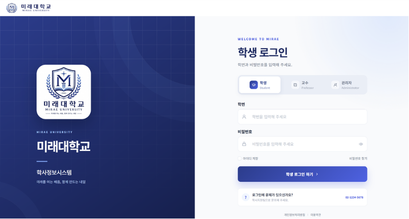
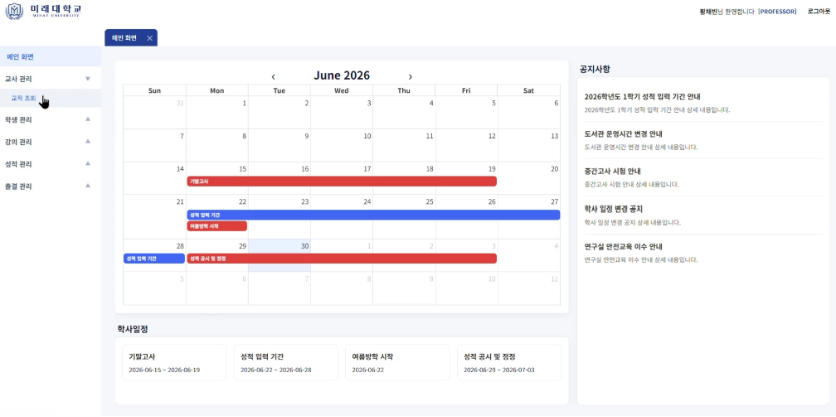

# 🏫 미래대학교 학사관리시스템

> 학생과 교수의 학사 업무를 하나의 웹 환경에서 처리하는 학사관리시스템입니다.
> JWT 기반 인증과 역할별 권한 제어를 바탕으로 강의, 수강신청, 시간표, 출결, 성적, 학적 업무를 제공합니다.

[백엔드 저장소](https://github.com/msa4-lms/msa4-lms) · [프론트엔드 저장소](https://github.com/msa4-lms/msa4-lms-client) · [프로젝트 문서](https://app.notion.com/p/MSA4-LMS-1-37dbf02975b380578d08d95862a13b71?source=copy_link) · [발표 자료](https://canva.link/vbbkpjihy0kn6w5) · [시연 영상](https://drive.google.com/file/d/1XI8K8ggCF-swAAxELeolvRCE6yN7k4iD/view?usp=sharing)




## 프로젝트 개요

| 구분 | 내용 |
| --- | --- |
| 진행 기간 | 2026.06.15 ~ 2026.07.03 |
| 프로젝트 형태 | 4인 팀 프로젝트 |
| 아키텍처 | Monolithic Architecture |
| Backend | Java 17, Spring Boot, Spring Security, MyBatis, MySQL |
| Frontend | Vue 3, Vite, Pinia, Vue Router, Axios |
| Infra | Docker, Nginx, Jenkins |

## 사용자별 주요 기능

| 사용자 | 주요 기능 |
| --- | --- |
| 공통 | 로그인, 로그아웃, 토큰 재발급, 비밀번호 변경, 강의 목록 조회 |
| 학생 | 프로필·학적 조회, 수강신청·취소, 시간표, 성적·GPA 조회, 출결 조회, 공결 신청, 휴·복학 신청 |
| 교수 | 프로필 조회, 강의 개설·관리, 출결 등록·수정, 공결 처리, 성적 입력·정정·공개 |

## 핵심 구현

### 인증과 권한 관리

- JWT에 사용자 역할을 담아 `STUDENT`, `PROFESSOR`, `ADMIN` 권한을 구분했습니다.
- Access Token과 Refresh Token을 이용한 로그인, 로그아웃, 토큰 재발급 흐름을 구현했습니다.
- Spring Security에서 역할별 API 접근 경로를 제어했습니다.

### 수강신청 정합성

- 학년, 단과대, 학과, 검색어를 기준으로 신청 가능한 강의를 조회할 수 있습니다.
- 중복 신청, 정원 초과, 시간표 중복을 검증합니다.
- 동시에 발생하는 수강신청 요청에서도 정원을 보호할 수 있도록 DB Lock을 적용했습니다.
- `APPLY`, `CANCEL`, `RETAKE` 상태로 수강 변경 이력을 관리합니다.

### 출결과 성적 처리

- 교수는 강의별 출결을 등록·수정하고 공결 신청을 처리할 수 있습니다.
- 학생은 본인의 출결 현황과 공결 승인 결과를 확인할 수 있습니다.
- 출석률을 계산하고 75% 미만인 경우 자동으로 F 학점을 처리합니다.
- 성적은 `DRAFT`부터 `FINAL`까지 상태를 구분해 입력, 제출, 공개, 정정 흐름을 관리합니다.

## 대표 업무 흐름

```text
학기 준비
교수 강의 개설 → 학생 수강신청 → 시간표 확인

수업 진행
교수 출결 등록 → 학생 출결 확인·공결 신청 → 교수 승인

성적 처리
교수 성적 입력·제출 → 학생 성적 확인 → 교수 성적 정정·확정

학적 변경
학생 휴·복학 신청 → 승인 처리 → 학적 상태 확인
```

## 시스템 구성

```text
[ Vue 3 Client ]
        |
        | Axios / REST API
        v
[ Spring Boot Application ]
        |
        |-- Auth / User / Profile
        |-- Lecture / Enrollment
        |-- Grade / Attendance
        |-- Leave & Return / Dashboard
        v
[ MySQL Database ]
```

도메인별 패키지를 분리해 각 영역의 책임을 구분하고, 공통 응답과 예외 처리 구조를 적용했습니다.

## 기술 스택

| 구분 | 기술 |
| --- | --- |
| Backend | Java 17, Spring Boot, Spring Security, JJWT, MyBatis, Bean Validation |
| Database | MySQL |
| Frontend | Vue 3, Vite, Pinia, Vue Router, Axios, FullCalendar, Day.js |
| Infra | Docker, Nginx, Jenkins |
| Collaboration | GitHub, Notion, Figma |

## 팀원 및 담당 역할

| 팀원 | 담당 영역 | 핵심 구현 |
| --- | --- | --- |
| 도진희 | 인증·권한, 프로필, 공통 UI, 대시보드, 성적 정정 | JWT 인증·권한 구조와 공통 컴포넌트 설계 |
| 홍대운 | 수강신청·취소·이력, 휴·복학, 교수 출결 | 중복·정원 초과 방지, DB Lock 기반 동시성 제어 |
| 조수혁 | 시간표, 성적 조회, 출결·공결 | 시간표 시각화, 출석률 계산과 자동 F 처리 |
| 김정태 | 강의 개설·관리, 성적 관리 | 성적 산출·공개·정정 상태 흐름 구현 |

## 협업 방식

- 기능 단위 브랜치와 Pull Request를 사용해 구현 내용을 공유하고 리뷰했습니다.
- 공통 컴포넌트와 UI 기준을 마련해 화면의 일관성을 유지했습니다.
- 간트 차트로 일정과 진행 상태를 관리하고 회의록으로 주요 결정을 기록했습니다.

## 설계 및 관련 자료

- [프로젝트 문서](https://app.notion.com/p/MSA4-LMS-1-37dbf02975b380578d08d95862a13b71?source=copy_link)
- [요구사항·이벤트 스토밍](https://www.figma.com/board/bwXgNXQMbEUjTGE2sumR8d/%ED%95%99%EC%82%AC%EA%B4%80%EB%A6%AC-%EC%8B%9C%EC%8A%A4%ED%85%9C-1%EC%B0%A8-MVP-%EC%9D%B4%EB%B2%A4%ED%8A%B8-%EC%8A%A4%ED%86%A0%EB%B0%8D?node-id=0-1&t=0mCDPoPmUzzmrBMo-1)
- [UI 디자인](https://www.figma.com/design/YNNFcXtVYYwL1fdoXJEiXP/%ED%95%99%EC%82%AC%EA%B4%80%EB%A6%AC-%EC%8B%9C%EC%8A%A4%ED%85%9C-%EB%AF%B8%EB%9E%98%EB%8C%80%ED%95%99%EA%B5%90?node-id=0-1&t=1EnrqUNOMbNzKpRl-1)
- [시스템 플로우 차트](https://www.figma.com/board/IA4yT44J81GooMNY1l8QLC/%EC%A0%84%EC%B2%B4-%EC%8B%9C%EC%8A%A4%ED%85%9C-%EC%95%84%ED%82%A4%ED%85%8D%EC%B2%98?node-id=0-1&t=ry2nvK64Axx2DlgI-1)
- [발표 자료](https://canva.link/vbbkpjihy0kn6w5)
- [시연 영상](https://drive.google.com/file/d/1XI8K8ggCF-swAAxELeolvRCE6yN7k4iD/view?usp=sharing)
